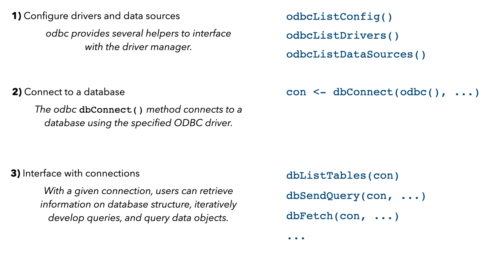

<!-- README.md is generated from README.Rmd. Please edit that file -->

```{r, echo = FALSE}
knitr::opts_chunk$set(
  collapse = TRUE,
  comment = "#>",
  fig.path = "README-",
  eval = as.logical(Sys.getenv("ODBC_EVAL_README", "false"))
)
```

# odbc
<!-- badges: start -->
[](https://www.repostatus.org/)
[](https://cran.r-project.org/package=odbc)
[](https://github.com/r-dbi/odbc/actions/workflows/R-CMD-check.yaml)
[](https://app.codecov.io/gh/r-dbi/odbc?branch=main)
<!-- badges: end -->

The goal of the odbc package is to provide a [DBI](https://dbi.r-dbi.org/)-compliant interface to [Open Database Connectivity](https://learn.microsoft.com/en-us/sql/odbc/microsoft-open-database-connectivity-odbc?view=sql-server-ver15)
(ODBC) drivers. This allows for an efficient, easy to setup connection to any
database with support for ODBC.

## Overview

The odbc package is one piece of the R interface to databases with support for ODBC:

```{r whole-game, eval = TRUE, echo = FALSE, fig.alt = 'A diagram containing four boxes with arrows linking each pointing left to right. The boxes read, in order, "R interface," "driver manager," "ODBC driver," and "database." The left-most box, R interface, contains three smaller components, labeled "dbplyr," "DBI," and "odbc."'}
knitr::include_graphics("man/figures/whole-game.png")
```

The package supports any **database** with ODBC support, including [SQL Server](https://www.microsoft.com/en-us/sql-server/), [Oracle](https://www.oracle.com/database), [MySQL](https://www.mysql.com/), [PostgreSQL](https://www.postgresql.org/), [SQLite](https://sqlite.org/index.html), and others.

Support for a given database is provided by an **ODBC driver**, which defines how to interact with that database using the standardized syntax of ODBC and SQL.

One of the central benefits of ODBC is its interoperability; any database with drivers available is accessible through ODBC. To manage information about these drivers and the data sources they provide access to, our computers use a **driver manager**. Windows is bundled with a driver manager, while MacOS and Linux require installation of one; this package supports the [unixODBC](https://www.unixodbc.org/) driver manager.

In the **R interface**, the [DBI package](https://dbi.r-dbi.org/) provides a front-end while odbc implements a back-end to communicate with the driver manager. The odbc package is built on top of the
[nanodbc](https://nanodbc.github.io/nanodbc/) C++ library. To interface with databases using R and odbc:

```{r r-interface, eval = TRUE, echo = FALSE, fig.alt = 'A diagram showing a high-level workflow for using the R interface in 3 steps. In step 1, configure drivers and data sources, the functions odbcListDrivers() and odbcListDataSources() help to interface with the driver manager. In step 2, the dbConnect() function, called with the first argument odbc(), connects to a database using the specified ODBC driver to create a connection object "con." Finally, in step 3, that connection object can be passed to various functions to retrieve information on database structure, iteratively develop queries, and query data objects.'}

```

The "Installing and Configuring Drivers" vignette gives example code for establishing a connection `con` for several different databases. See the [Usage section](#usage) below for example code.

## Installation 

Install the latest release of odbc from CRAN with the following code:

```r
install.packages("odbc")
```

To get a bug fix or to use a feature from the development version, you can install the development version of odbc from GitHub:

```r
# install.packages("pak")
pak::pak("r-dbi/odbc")
```

odbc and its dependencies use C++11 features. Therefore, you need [gcc 4.8](https://gcc.gnu.org/), [clang 3.3](https://clang.llvm.org), or [Rtools 3.3](https://CRAN.R-project.org/bin/windows/Rtools/) or later.

## Usage

All of the following examples assume you have already created a connection `con`. See the "Installing and Configuring Drivers" vignette for more information on establishing a connection.

<!-- TODO: link to the deployed vignette above -->

`dbListTables()` is used for listing all existing tables in a database.

```r
dbListTables(con)

# List tables beginning with f
dbListTables(con, table_name = "f%")

# List all fields in the 'flights' database
dbListFields(con, "flights")
```

`dbReadTable()` will read a full table into an R `data.frame()`.

```r
data <- dbReadTable(con, "flights")
```

`dbWriteTable()` will write an R `data.frame()` to an SQL table.

```r
dbWriteTable(con, "iris", iris)
```

`dbGetQuery()` will submit a SQL query and fetch the results. It is also possible to submit the query and fetch separately with `dbSendQuery()` and `dbFetch()`. The `n` argument to `dbFetch()` can be used to fetch only part of a query result (the next *n* rows).

```r
result <- 
  dbSendQuery(
    con, 
    "SELECT flight, tailnum, origin FROM flights ORDER BY origin"
  )

# Retrieve the first 100 results
first_100 <- dbFetch(result, n = 100)

# Retrieve the rest of the results
rest <- dbFetch(result)
```

To generate SQL code using dplyr syntax, see the [dbplyr package](https://dbplyr.tidyverse.org/).

## Benchmarks

The odbc package is often much faster than the existing
[RODBC](https://cran.r-project.org/package=RODBC) and DBI compatible
[RODBCDBI](https://cran.r-project.org/package=RODBCDBI) packages.

Reading a table from a SQL Server database with the 'flights' dataset (336,776
rows, 19 columns) of the package [nycflights13](https://github.com/tidyverse/nycflights13):

```{r}
# First using RODBC / RODBCDBI
library(DBI)

rodbc <- 
  dbConnect(
    RODBCDBI::ODBC(), 
    dsn = "MicrosoftSQLServer", 
    user = Sys.getenv("SQLSERVER_UID"), 
    password = Sys.getenv("SQLSERVER_PWD")
  )

system.time(rodbc_result <- dbReadTable(rodbc, "flights"))
#>    user  system elapsed 
#>  13.986   1.173  15.192

# Now using odbc
odbc <- 
  dbConnect(
    odbc::odbc(), 
    dsn = "MicrosoftSQLServer", 
    UID = Sys.getenv("SQLSERVER_UID"), 
    PWD = Sys.getenv("SQLSERVER_PWD")
  )

system.time(odbc_result <- dbReadTable(odbc, "flights"))
#>    user  system elapsed 
#>   1.334   0.065   1.406

tibble::as_tibble(odbc_result)
#> # A tibble: 336,776 x 19
#>     year month   day dep_time sched_dep_time dep_delay arr_time
#>    <int> <int> <int>    <int>          <int>     <dbl>    <int>
#>  1  2013     1     1      517            515         2      830
#>  2  2013     1     1      533            529         4      850
#>  3  2013     1     1      542            540         2      923
#>  4  2013     1     1      544            545        -1     1004
#>  5  2013     1     1      554            600        -6      812
#>  6  2013     1     1      554            558        -4      740
#>  7  2013     1     1      555            600        -5      913
#>  8  2013     1     1      557            600        -3      709
#>  9  2013     1     1      557            600        -3      838
#> 10  2013     1     1      558            600        -2      753
#> # … with 336,766 more rows, and 12 more variables: sched_arr_time <int>,
#> #   arr_delay <dbl>, carrier <chr>, flight <int>, tailnum <chr>,
#> #   origin <chr>, dest <chr>, air_time <dbl>, distance <dbl>, hour <dbl>,
#> #   minute <dbl>, time_hour <dttm>

identical(dim(rodbc_result), dim(odbc_result))
#> [1] TRUE

rm(rodbc_result, odbc_result, odbc, rodbc)
gc(verbose = FALSE)
```

Writing the same dataset to the database:

```{r, echo = FALSE, results = "hide"}
odbc <- 
  dbConnect(
    odbc::odbc(), 
    dsn = "MicrosoftSQLServer", 
    UID = Sys.getenv("SQLSERVER_UID"), 
    PWD = Sys.getenv("SQLSERVER_PWD")
  )
if (dbExistsTable(odbc, "flights2")) { dbRemoveTable(odbc, "flights2") }
if (dbExistsTable(odbc, "flights3")) { dbRemoveTable(odbc, "flights3") }
rm(odbc)
gc(verbose = FALSE)
```

```{r, cache = TRUE}
library(nycflights13)
# rodbc does not support writing timestamps natively, so we remove that column
flights2 <- as.data.frame(flights[, names(flights) != "time_hour"])

rodbc <- 
  dbConnect(
    RODBCDBI::ODBC(), 
    dsn = "MicrosoftSQLServer", 
    user = Sys.getenv("SQLSERVER_UID"), 
    password = Sys.getenv("SQLSERVER_PWD")
  )

system.time(dbWriteTable(rodbc, "flights2", flights2))
#>    user  system elapsed
#>  11.891   6.269 765.269

# Now using odbc
odbc <- 
  dbConnect(
    odbc::odbc(), 
    dsn = "MicrosoftSQLServer", 
    UID = Sys.getenv("SQLSERVER_UID"), 
    PWD = Sys.getenv("SQLSERVER_PWD")
  )

flights3 <- as.data.frame(flights)
system.time(dbWriteTable(odbc, "flights3", flights3))
#>    user  system elapsed
#>   2.617   0.275   9.649
```
